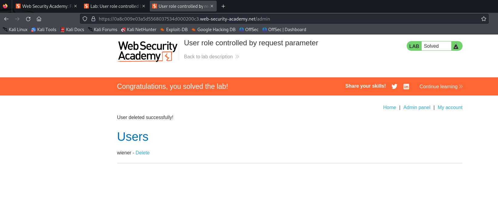

# Lab Report: User Role Controlled by Request Parameter

## Overview
This lab from **PortSwigger Web Security Academy** demonstrates an access control vulnerability 
where a user’s role is determined by a request parameter (cookie) that can be forged. Exploiting 
this weakness allows an attacker to escalate privileges and perform administrative actions 
without authorization.

**Lab Goal:**
- Access the `/admin` panel
- Delete the user `carlos`

**Credentials provided:**
- Username: `wiener`
- Password: `peter`

---

## Steps to Exploitation

### 1. Login as Normal User
- Logged in using the provided credentials (`wiener:peter`).
- Observed normal user functionality.

### 2. Identifying Role-Based Access Control
- Inspected session cookies and found a parameter that defines the role.
- The role value could be modified by the client.

### 3. Escalating Privileges
- Modified the role value in the cookie from `user` to `admin`.
- Reloaded the session and gained access to the `/admin` panel.

### 4. Accessing the Admin Panel
- Navigated to `/admin`.
- Confirmed admin privileges were active.

### 5. Deleting Target User
- Found the user `carlos` in the admin user list.
- Used the delete function to remove the account.

---

## Result
- Successfully deleted the target user **carlos**.
- Lab status changed to:  
  ✅ *"Congratulations, you solved the lab!"*

---

## Root Cause
The application relies only on a **client-side controlled parameter** to determine authorization.  
This is insecure because:
- Cookies/parameters can be manipulated by attackers.
- No server-side validation is performed to confirm admin rights.

---

## Mitigation Recommendations
1. Enforce server-side role validation.  
2. Store user roles securely on the server.  
3. Implement proper Role-Based Access Control (RBAC).  
4. Regularly test applications for IDOR and broken access control issues.  

---

## Skills Demonstrated
- Authentication & session analysis  
- Cookie manipulation for privilege escalation  
- Access control vulnerability exploitation  
- Web security testing methodology  

---

## References
- [PortSwigger Lab: User role controlled by request parameter](https://portswigger.net/web-security/access-control/lab-user-role-controlled-by-request-parameter)

---

## Screenshots
  

